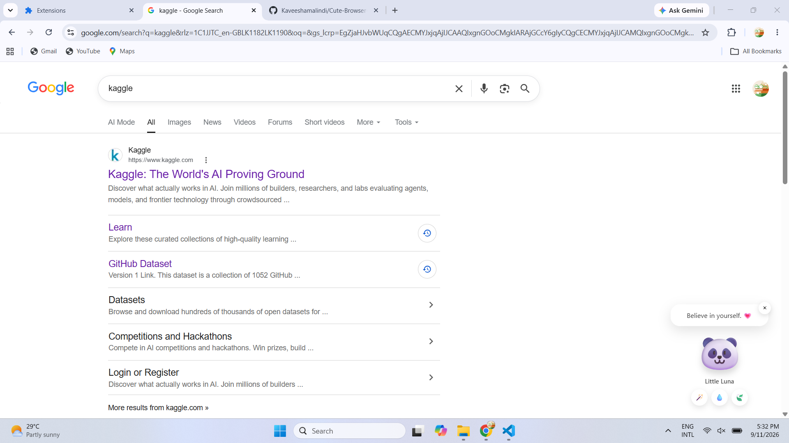

# 🐼 Cute Browser Companion

A simple and aesthetic browser companion extension that stays on your screen while you browse. 🌸

It provides small reminders for **motivation, hydration, and taking breaks**.

<p align="center">
  
</p>

---

## ✨ Features

* 🐼 Cute floating browser companion
* 🪄 Random motivational messages
* 💧 Hydration reminders
* 🍃 Break reminders
* 🥰 Interactive character
* ⏰ Automatic reminders
* 🎨 Simple and aesthetic UI
* ❌ Close button to hide the companion

---

## ⏰ Reminders

| Reminder      |         Interval |
| ------------- | ---------------: |
| 🪄 Motivation | Every 20 minutes |
| 💧 Hydration  | Every 45 minutes |
| 🍃 Break      | Every 60 minutes |

You can also manually trigger each reminder using the buttons.

---

## 🛠️ Technologies

* HTML
* CSS
* JavaScript
* Chrome Extension Manifest V3

---

## 📁 Project Structure

```text
cute-browser-companion/
│
├── manifest.json
├── content.js
└── style.css
```

### `manifest.json`

Defines the browser extension configuration and loads the content script and stylesheet on web pages.

### `content.js`

Contains the companion's functionality, messages, buttons, animations, reminders, and interactions.

### `style.css`

Controls the appearance, positioning, animations, buttons, and overall aesthetic design.

---

## 🚀 How to Run

1. Download or clone this repository.
2. Open Chrome and go to:

```text
chrome://extensions/
```

3. Enable **Developer mode**.
4. Click **Load unpacked**.
5. Select the project folder.
6. Open any website.
7. Your 🐼 **Little Luna** companion will appear.

---

## 💡 How It Works

The extension uses a **content script** to create the companion directly inside the webpage.

No backend, database, AI model, or API is required.

```text
Browser
   ↓
Chrome Extension
   ↓
Content Script
   ↓
Cute Companion
   ↓
Motivation / Water / Break Reminders
```

---

## 🌱 Future Ideas

* 🌙 Dark mode
* 🎭 More characters
* 💬 More messages
* 🎵 Small relaxing sounds
* ⚙️ Custom reminder intervals
* 🎨 More themes and animations
* 📊 Simple productivity statistics
* 🤖 AI Integration 

---

## 💗 Purpose

This project was created as a small beginner-friendly JavaScript project to explore **browser extensions, DOM manipulation, CSS animations, event handling, and timers** while creating something fun and useful.

---

 Made with ⭐ JavaScript & a little bit of magic. 